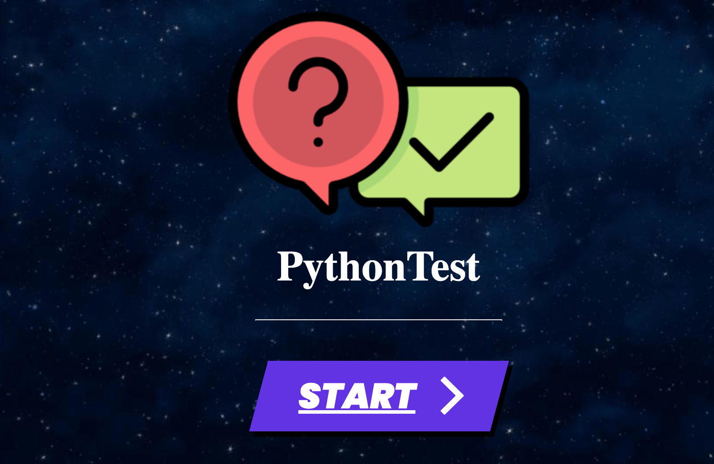
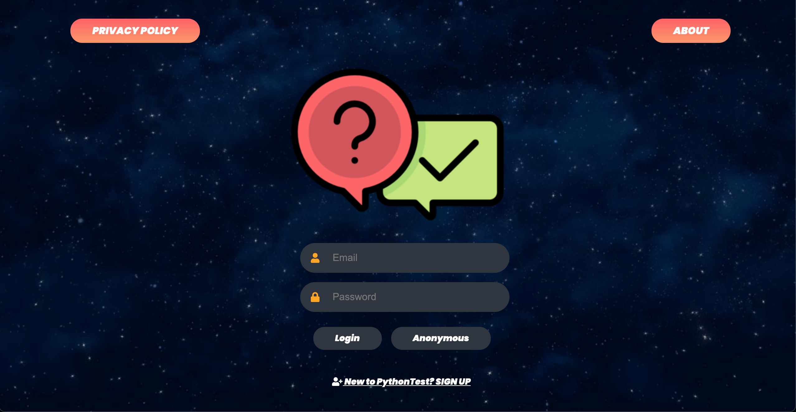
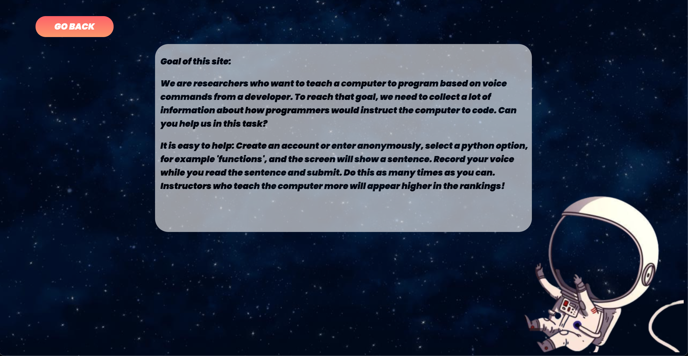
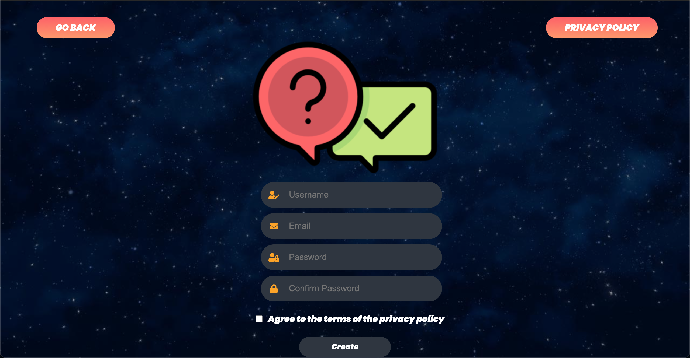
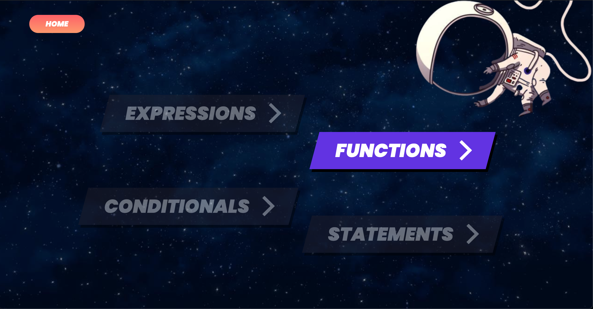
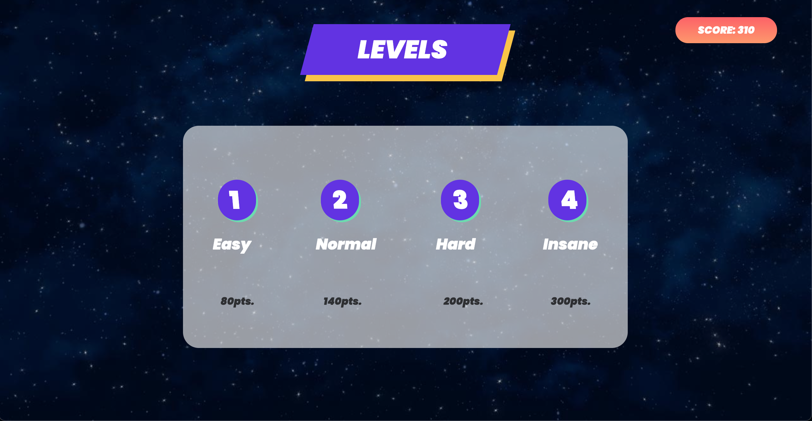
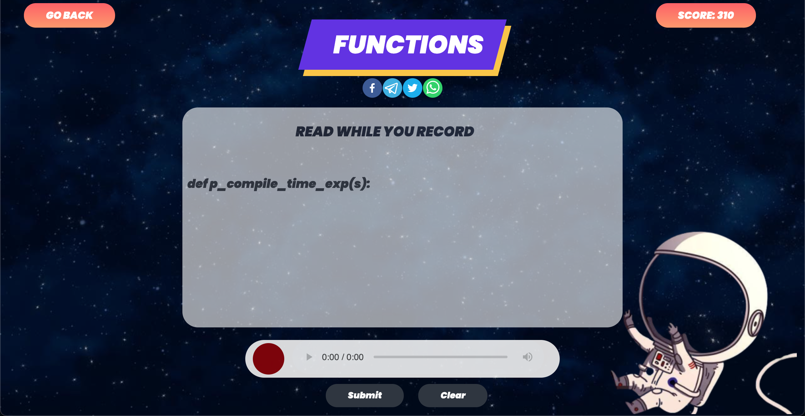
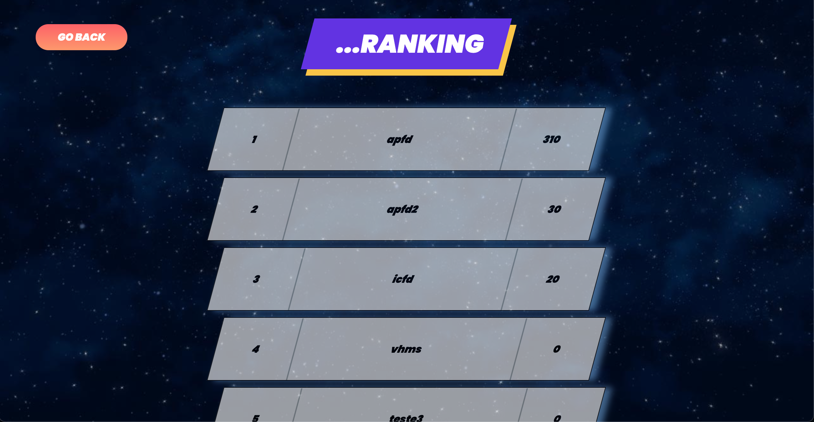
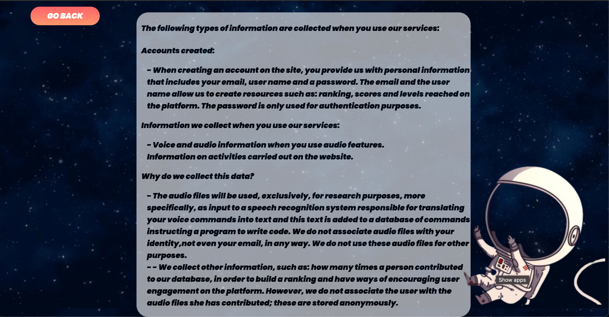

<!-- PROJECT LOGO -->
 

  

  <h3 align="center">Python Speech Game</h3>

  

This site was created during a scientific research entitled: deep learning as a support for voice programming and which I was guided by professor Fernando Castor. The site's intention is to collect the maximum number of audios, more precisely function signatures, to develop a database in the creation of the deep learning model. The collected audios will only be used to be translated and there is no user identification in sensitive data. Furthermore, the site has been validated by Hidehiko Masuhara - Tokyo Institute of Technology.
     
    <a href="https://github.com/apfdamascena/double-dip"><strong>Explore the docs »</strong></a>
     
     
    ·
    <a href="https://github.com/apfdamascena/double-dip/issues">Report Bug</a>
    ·
    <a href="https://github.com/apfdamascena/double-dip/issues">Request Feature</a>
  

<!-- TABLE OF CONTENTS -->

  
<h2 style="display: inline-block">Table of Contents</h2>

  <ol>
    <li><a href="#contributors">Contributors</a></li>
    <li>
      <a href="#about-the-project">About The Project</a>
      <ul>
        <li><a href="#built-with">Built With</a></li>
      </ul>
    </li>
        <li><a href="#abstract">Abstract</a></li>
        <li><a href="#facepe">Facepe</a></li>
<li><a href="#what-was-done">What Was Done</a></li>

<li><a href="#contact">Contact</a></li>
  </ol>

## Contributors

<table>
  <tr>
<td align="center"><a href="https://github.com/apfdamascena"> <b>Alex Damascena</b></a> </td>
</tr>
 </table>

## About The Project

This site was created during a scientific research entitled: deep learning as a support for voice programming and which I was guided by professor Fernando Castor. The site's intention is to collect the maximum number of audios, more precisely function signatures, to develop a database in the creation of the deep learning model. The collected audios will only be used to be translated and there is no user identification in sensitive data. Furthermore, the site has been validated by Hidehiko Masuhara - Tokyo Institute of Technology.

### Built With

* [ React ]( https://pt-br.reactjs.org/ )

## Abstract

There are numerous barriers to access technology and software development, which keep away new developers who can add, with new research, the academic area and boost the technology market. Voice-based programming appears in order to democratize access to software development, especially for developers with physical disabilities - loss or impairment of upper limbs - and neurological diseases [1]. Similarly, one can list other groups that are unfeasible in the area of programming, such as: people with repetitive stress disorder [2] and visual impairment. Thus, it is clear that offering alternatives such as voice programming to these groups provides inclusion and alleviates pain in the developer's daily life.

## Facepe

the Pernambuco Foundation for Science and Technology Support (FACEPE) has the function of promoting the state's scientific and technological development, through the promotion of science, technology and innovation, keeping a close line with meeting its socioeconomic needs. Financing is carried out mainly through the granting of scholarships or research and the granting of financial aid to researchers to fund both scientific or technological research projects developed by local researchers, as well as other relevant activities in science, technology and innovation, such as the organization of scientific courses and meetings, the carrying out of internships for the training of researchers, the participation of researchers in scientific congresses outside the state, etc. Other financing lines are intended to encourage the process of technological innovation in companies, including through the granting of economic subsidy to innovation.

<strong>This project was funded by FACEPE</strong>

## What Was Done

The development of the website is based on concepts present in the research by Ajami and colleagues, which uses gamification in data collection to motivate user engagement on the platform. Thus, three techniques were used in the creation of the website: rewards for using platform resources, unlocking levels and competition among users. All these concepts used are present in an experiment carried out by Sailer and colleagues to understand how gamification motivates and game design in satisfying psychological needs.

| | | |
|:-------------------------:|:-------------------------:|:-------------------------:|
|  Logo |   Login | About us
|  New User |   Option Page | Level Page

| | | |
|:-------------------------:|:-------------------------:|:-------------------------:|
|  Game Page |   Ranking Page | Privacy 

## Contact
- Alex Damsacena - apfd@cin.ufpe.br

<!-- MARKDOWN LINKS & IMAGES -->
<!-- https://www.markdownguide.org/basic-syntax/#reference-style-links -->
[contributors-shield]: https://img.shields.io/github/contributors/github_username/repo.svg?style=for-the-badge
[contributors-url]: https://github.com/github_username/repo/graphs/contributors
[forks-shield]: https://img.shields.io/github/forks/github_username/repo.svg?style=for-the-badge
[forks-url]: https://github.com/github_username/repo/network/members
[stars-shield]: https://img.shields.io/github/stars/github_username/repo.svg?style=for-the-badge
[stars-url]: https://github.com/github_username/repo/stargazers
[issues-shield]: https://img.shields.io/github/issues/github_username/repo.svg?style=for-the-badge
[issues-url]: https://github.com/github_username/repo/issues
[license-shield]: https://img.shields.io/github/license/github_username/repo.svg?style=for-the-badge
[license-url]: https://github.com/github_username/repo/blob/master/LICENSE.txt
[linkedin-shield]: https://img.shields.io/badge/-LinkedIn-black.svg?style=for-the-badge&logo=linkedin&colorB=555
[linkedin-url]: https://linkedin.com/in/github_username